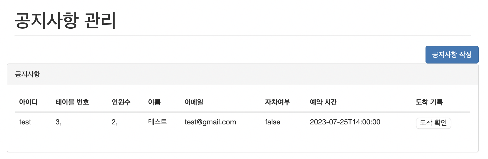

# 레스토랑 예약 시스템 by SPRING
회원에게 비대면 레스토랑 예약시스템 및 관리자에게 예약 및 레스토랑 관리를할 수 있게 도와주는 레스토랑 예약 시스템이다.

## 1. 메인페이지

### 지도

## 2. 로그인, 회원가입

### 로그인

### 회원가입

## 3. 예약

### 예약
- 인원, 메뉴, 예약일, 예약시간, 자차 여부 선택 가능
- 테이블 선택 눌러서 원하는 테이블의 위치 확인 후 테이블 선택 가능

### 예약 확인(마이페이지)
- 마이페이지에서 예약한 예약 정보 확인 가능 

## 4. 관리자 페이지

### 관리자 페이지
- 관리자 페이지에서 대기리스트 확인, 통계, 테이블 관리, 재고관리, 워크인 등록 가능
- 대기리스트 확인을 통해 도착 기록 가능

### 재고 관리
- 재고 관리 기능을 통해 새로운 재고 및 없는 재고 삭제 가능

### 테이블 관리
- 테이블 관리를 통해 새로운 테이블 등록 및 삭제 가능

### 관리자 예약
- 워크인 등록을 통해 관리자가 직접 예약 등록 가능
